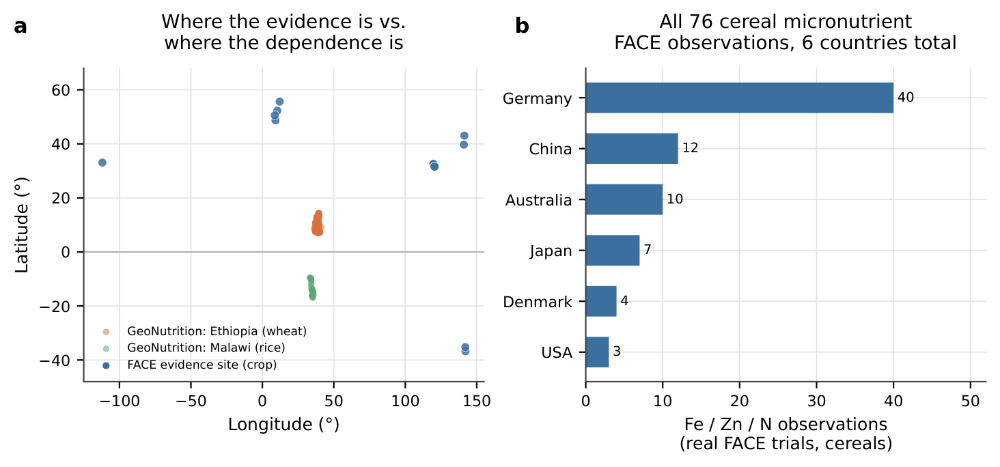
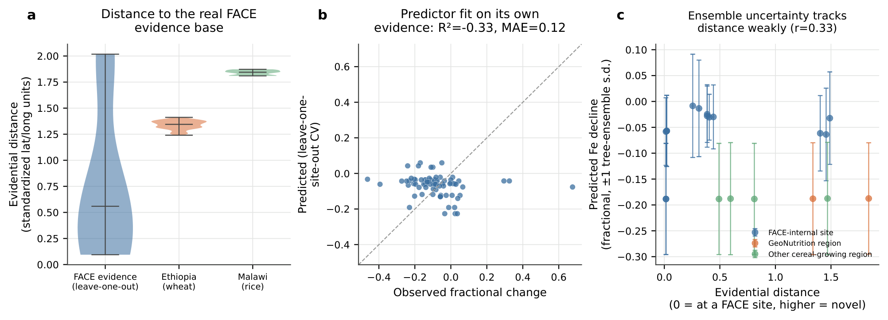
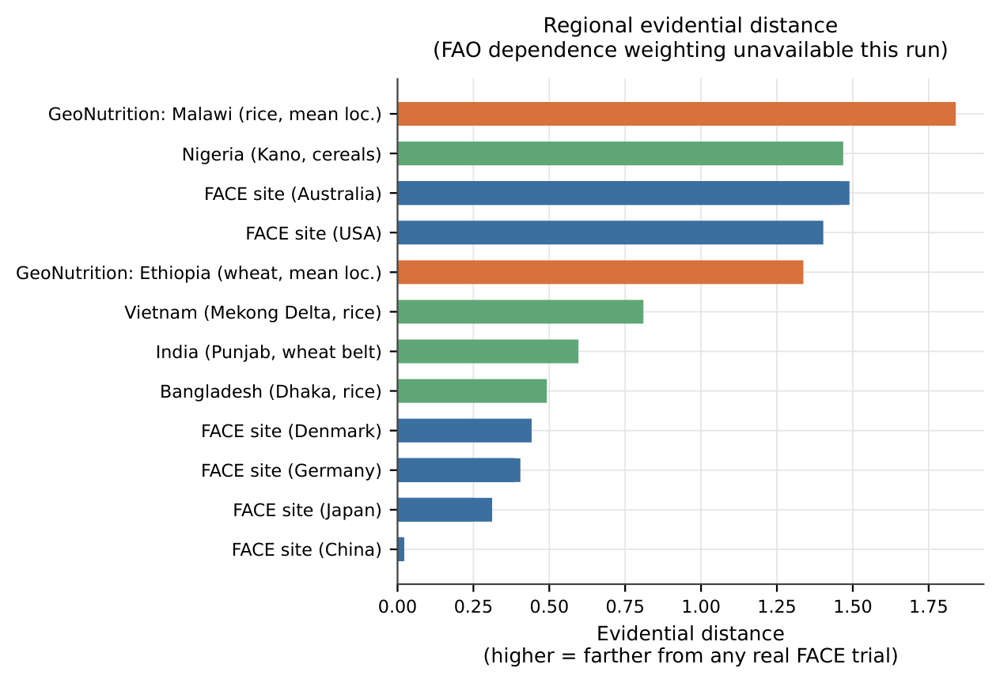
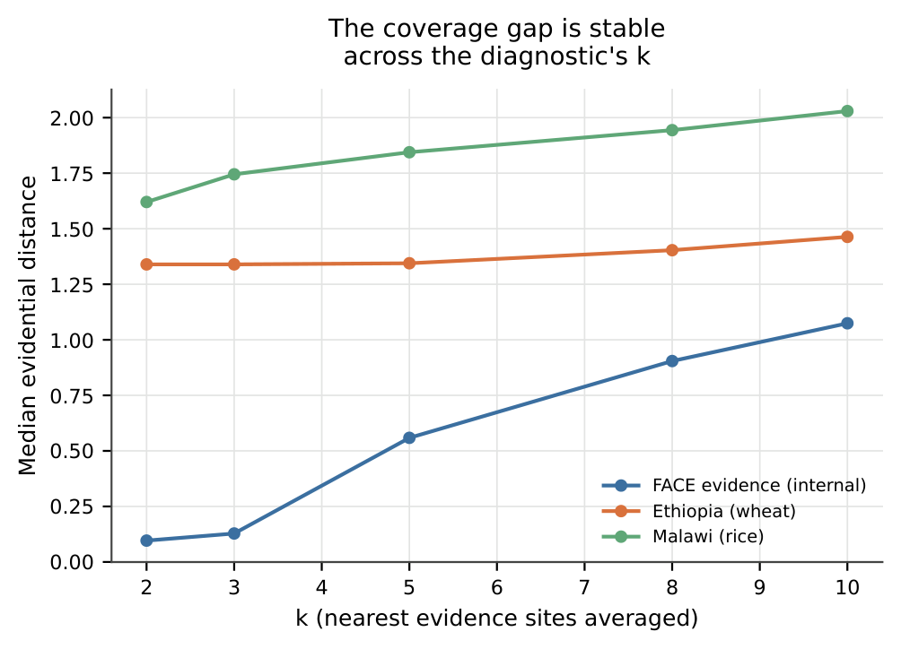
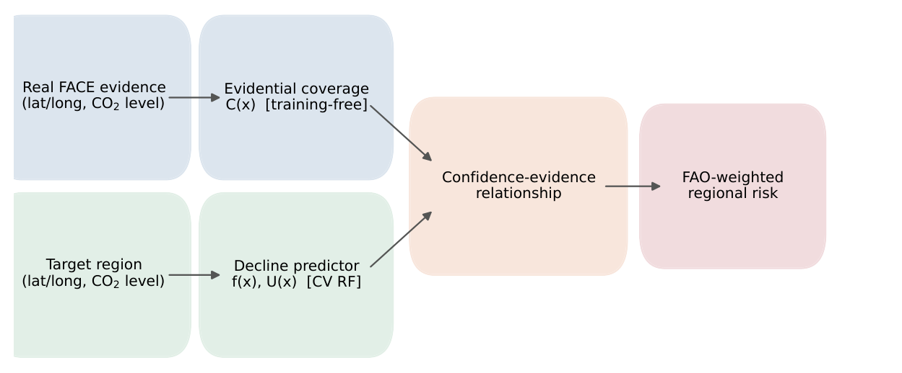

# Hidden Hunger, Hidden Uncertainty

**Auditing the Evidential Blind Spots of Climate-Nutrition Models**

*Submitted to the NeurIPS 2026 Workshop on Tackling Climate Change with Machine Learning (Climate Change AI) — Papers Track*

[](https://www.python.org/)
[](LICENSE)
[]()

> This repository accompanies an anonymous double-blind submission. It intentionally contains no author-identifying information; see [Anonymity](#anonymity--reproducibility-status) below.

---

## Overview

Elevated atmospheric CO₂ measurably lowers the protein, iron, and zinc content of staple cereals — a phenomenon the plant science literature calls **hidden hunger**. The experimental evidence for this effect comes almost entirely from Free-Air CO₂ Enrichment (FACE) trials, and that evidence base is small and geographically concentrated in a handful of high-income, temperate countries — while the populations most dependent on rice and wheat for daily nutrition live almost entirely outside it.

This project introduces **evidential distance**, a training-free, model-agnostic diagnostic that measures how far a target region sits from the real experimental evidence a climate-nutrition model is built on — computed independently of any model's own reported confidence — and validates it against independent ground truth the evidence base never saw.

Every number in the paper and in this repository is computed by the pipeline in this repo, from three public datasets, with a fixed random seed. Nothing is simulated or hand-tuned to a target result.

## Key findings

| Finding | Value |
|---|---|
| Real FACE evidence footprint (all crops) | 295 observations, **14 sites, 6 countries** — none in South Asia or Sub-Saharan Africa |
| Cereal Fe/Zn/N evidence subset | 76 observations, **11 independent sites** |
| Decline predictor, leave-one-site-out CV | **R² = −0.33**, MAE = 0.12 (reported without softening — see [paper](paper/hidden_hunger_hidden_uncertainty.pdf)) |
| Ensemble uncertainty vs. true evidential distance | **r = 0.33** — positive but weak; internal confidence is not a substitute for this diagnostic |
| Cereal-only robustness refit (n=71, 10 sites) | R² = −0.28, MAE = 0.123 — consistent with the full-panel result |
| **Highest-risk region identified** | **Ethiopian wheat** (Risk = 0.486), ahead of Vietnamese rice (0.407), Malawian rice (0.276), Bangladeshi rice (0.262), Indian wheat (0.166) |

Full 12-region ranking: [`results/regional_risk_ranking.csv`](results/regional_risk_ranking.csv).

## Repository structure

```
.
├── paper/                        Full LaTeX source and compiled PDF
│   ├── main.tex
│   ├── references.bib
│   ├── hidden_hunger_hidden_uncertainty.pdf
│   └── figures/                  Figures exactly as used in the paper (vector PDF)
├── notebooks/
│   └── hidden_hunger_hidden_uncertainty.ipynb   End-to-end, self-downloading experiment notebook
├── src/                          Reusable pipeline code the notebook is built on
│   ├── pipeline.py                Data loading, EvidentialCoverage diagnostic, cross-validated predictor
│   ├── style.py                   Shared matplotlib style
│   └── make_figures.py            Figure-generation script
├── figures/                      All 5 figures (PDF, vector) + PNG previews for quick viewing
├── results/                      Real, computed result tables
│   ├── results.json               Headline summary statistics
│   ├── query_predictions.csv      Per-region evidential distance, predicted decline, uncertainty
│   ├── robustness_by_k.csv        Evidential-distance stability sweep (k = 2, 3, 5, 8, 10)
│   └── regional_risk_ranking.csv  Full 20-row ranking underlying the paper's Table 4
├── requirements.txt
├── LICENSE
└── README.md
```

## Data sources (all public, all auto-downloaded)

The notebook downloads all three datasets directly from their original hosts at run time — no manual steps, no logins, no scraping:

1. **CO₂-ionome meta-analysis** underlying Loladze (2014), *eLife* — [github.com/loladze/co2](https://github.com/loladze/co2) (mirrors Dryad [doi:10.5061/dryad.6356f](https://doi.org/10.5061/dryad.6356f)). Source of every real FACE trial used.
2. **GeoNutrition surveys**, Ethiopia and Malawi — Kumssa et al. (2022), *Scientific Data* — [github.com/rmlark/GeoNutrition](https://github.com/rmlark/GeoNutrition). Independent, georeferenced ICP-MS grain-mineral ground truth the FACE literature never informed.
3. **FAOSTAT Food Balance Sheets** — bulk download from [fenixservices.fao.org/faostat](https://fenixservices.fao.org/faostat). Real per-country dietary dependence on cereals.

## Quickstart

```bash
git clone <this-repo-url>
cd hidden-hunger-hidden-uncertainty
pip install -r requirements.txt
jupyter notebook notebooks/hidden_hunger_hidden_uncertainty.ipynb
```

Run all cells top to bottom. The full pipeline — three dataset downloads, the evidential-distance diagnostic, the cross-validated random forest, and every figure — runs end to end on a single CPU; no GPU is used or required. A fixed random seed (`13`) makes the leave-one-site-out numbers exactly reproducible run to run.

**One honest caveat:** the FAOSTAT bulk download requires outbound access to `fao.org`. It works in a standard Colab/Kaggle/local environment; some locked-down sandboxes block it. If it fails, the notebook and Figure 5 degrade gracefully to an evidential-distance-only view rather than fabricating a weighted result — this is by design, not a bug.

## Method, in one paragraph

For a query region $x$ and the set $\mathcal{E}$ of real FACE evidence-site coordinates, **evidential distance** $d_k(x)$ is the mean standardized distance from $x$ to its $k$ nearest points in $\mathcal{E}$ — training-free, computed with no labels and no model. Separately, a lightweight random-forest predictor $f(x)$ estimates fractional nutrient decline with ensemble uncertainty $U(x)$, evaluated by leave-one-site-out cross-validation. Combining $d_k(x)$ with real FAOSTAT dietary-dependence weights $w(x)$ gives a regional risk score — high exactly where a region is both evidentially ungrounded and heavily dependent on the affected crop. Full definitions, formal properties, and pseudocode are in the paper's Appendix C.

## Figures

| | |
|---|---|
|  | **Fig. 1** — Where the real FACE evidence is vs. where dietary dependence is; the complete cereal Fe/Zn/N evidence base by country. |
|  | **Fig. 2** — Evidential-distance separation between FACE-internal sites and GeoNutrition ground truth; the predictor's honest cross-validated fit; ensemble uncertainty vs. evidential distance. |
|  | **Fig. 3** — Real evidential distance vs. real dietary dependence, and the resulting regional risk ranking. |
|  | **App. Fig.** — The evidence-vs-dependence gap is stable across the diagnostic's only hyperparameter, $k$. |
|  | **App. Fig.** — The full evidential-distance audit pipeline. |

## Citation

This work is currently under anonymous double-blind review. A full citation will be added here upon acceptance. In the meantime, if you build on this repository, please reference:

```bibtex
@misc{anonymous2026hiddenhunger,
  title        = {Hidden Hunger, Hidden Uncertainty: Auditing the Evidential Blind Spots of Climate-Nutrition Models},
  author       = {Anonymous},
  year         = {2026},
  note         = {Under double-blind review, NeurIPS 2026 Workshop on Tackling Climate Change with Machine Learning}
}
```

## Anonymity & reproducibility status

This repository is written to match the paper's own anonymous submission (no author name, institution, or contact details anywhere in this README, the paper source, or the code). If you intend to link this repository from the paper itself before review decisions are out, consider keeping it private or serving it through an anonymized host (e.g. [anonymous.4open.science](https://anonymous.4open.science)) rather than a public, identity-linked account, to preserve double-blind integrity. Swap in real author details here and in `paper/main.tex` only for the camera-ready version, after acceptance.

## Limitations

Stated plainly, matching the paper: the evidence base is genuinely small (11 sites); GeoNutrition is cross-sectional, not a CO₂-manipulation experiment, so it validates evidential *uncovering*, not the decline mechanism itself; the covariate space is latitude/longitude only; dietary dependence uses total cereal supply as a crop-agnostic proxy; and 2 of 20 query rows (both Japanese FACE sites) had no FAOSTAT match and were excluded rather than imputed. Full discussion in the paper's Limitations and Appendix sections.

## License

Code in this repository is released under the [MIT License](LICENSE). The three datasets it downloads are governed by their own original licenses/terms (linked above) and are not redistributed here — only the code that fetches and processes them.
